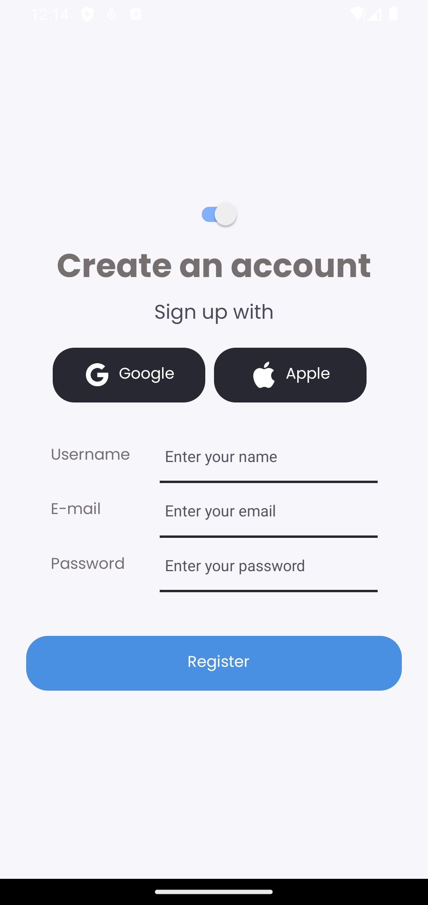
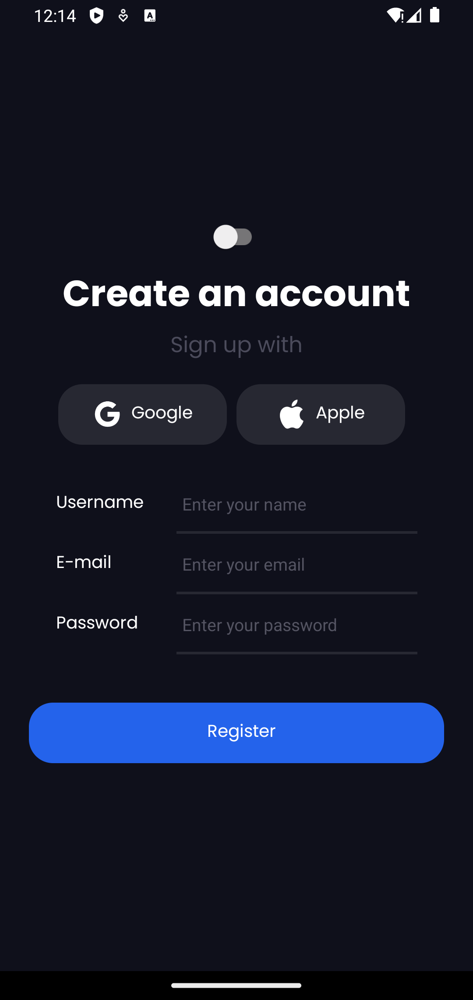
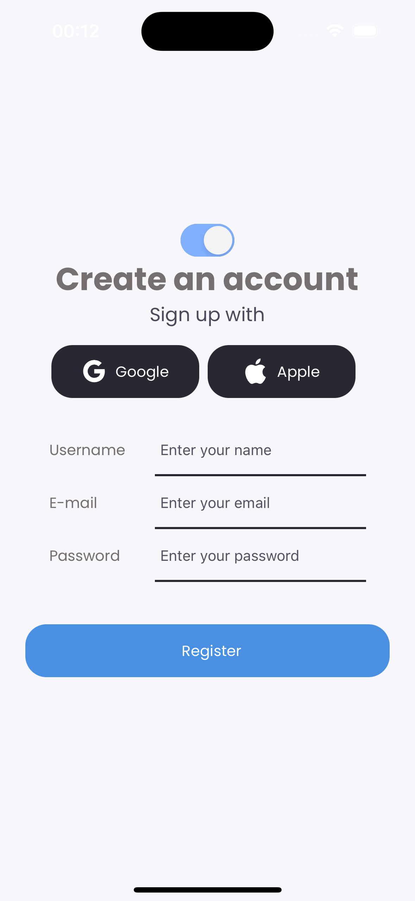
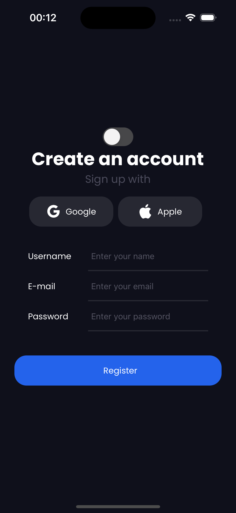

# React Native Login App Restyle

Login screen with darkmode and using restyle for the application's stylizations

### Run

**Install dependencies**

```
yarn
```

**Run App**

```
npx expo start
```

### 🛠 Tech and Libraries

- [React Native](https://reactnative.dev/)
- [TypeScript](https://www.typescriptlang.org/)
- [Restyle](https://shopify.github.io/restyle/): The Restyle library provides a type-enforced system for building UI components in React Native with TypeScript. It's a library for building UI libraries, with themability as the core focus.

  
### App Screenshots

|                |              Android (Light)               |              Android (Dark)               | IOS (Light)                            | IOS (Dark)                            |
| :------------: | :----------------------------------------: | :---------------------------------------: | -------------------------------------- | ------------------------------------- |
| Login Screen |  |  |  |  |

### Design Reference
- [Link Dribbble](https://dribbble.com/shots/23643858-Money-Manager-Onboarding-Screen)
